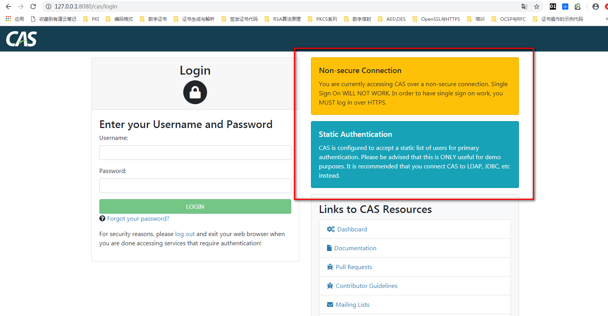
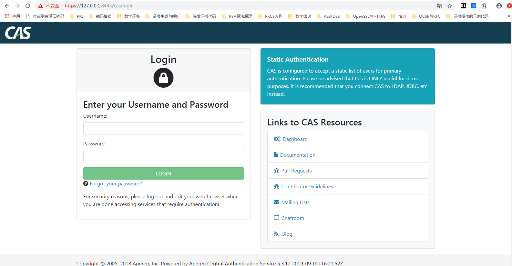
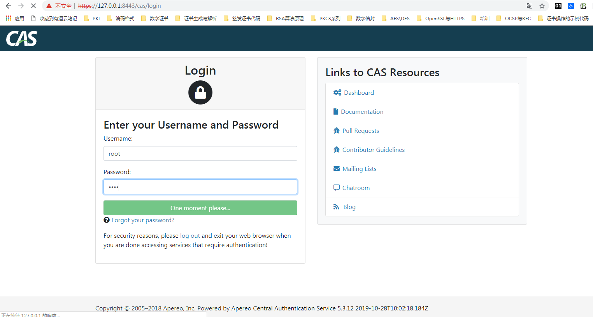
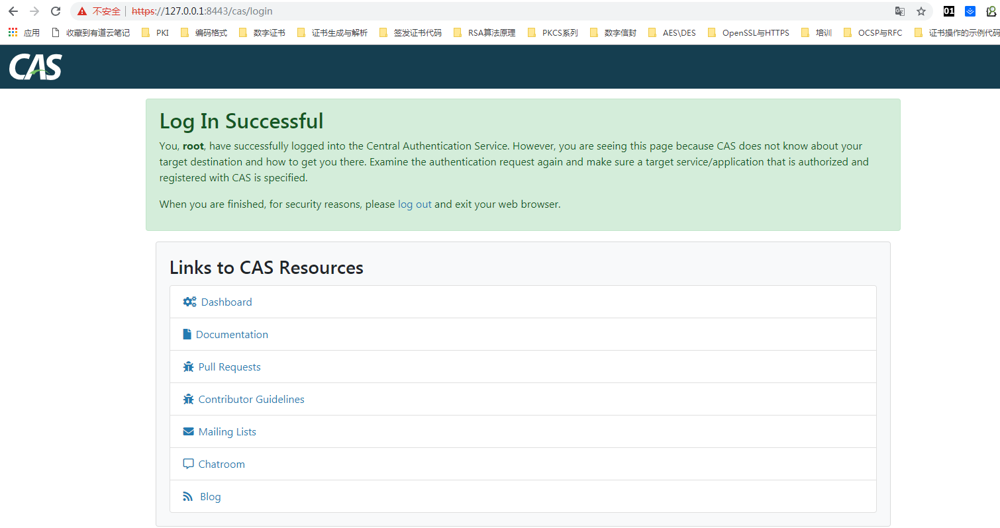
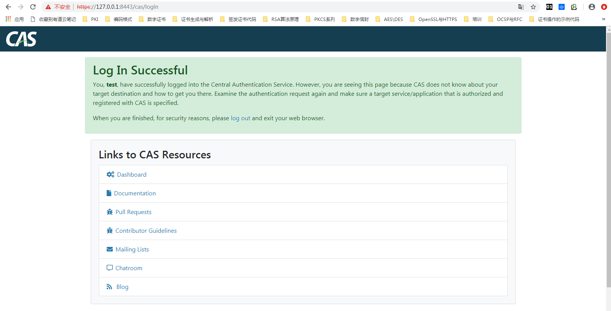
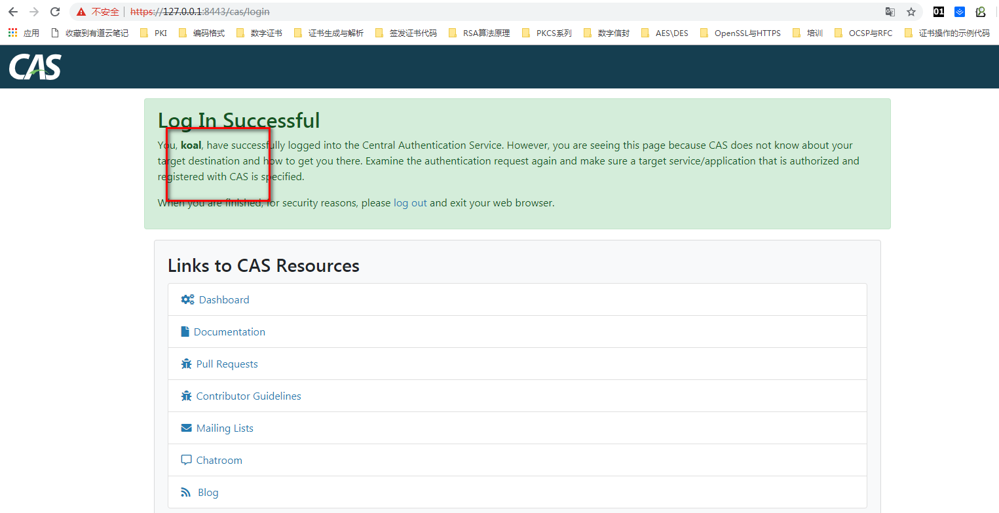
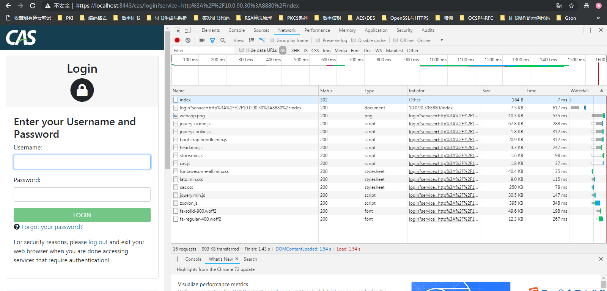

# CAS搭建及简单Demo实现单点登录

## 环境
- ubuntu server 16.04LTS
- docker 19.03.3
- cas v5.3.x
- JDK 1.8
## 本地搭建
### 拉取仓库并部署运行
- 从Github拉取CAS的[cas-overlay-template(maven)](https://github.com/apereo/cas-overlay-template/tree/5.3),[cas-gradle-overlay-template]()用于采用覆盖机制，打成可部署的包。接下来自定义策略等需要在该仓库的基础上进行定制，官方推荐采用`WAR Overlay method`方式进行部署。[官方文档](https://apereo.github.io/cas/5.3.x/installation/Maven-Overlay-Installation.html)
```
It is recommended to build and deploy CAS locally using the WAR Overlay method. 
This approach does not require the adopter to explicitly download any version of CAS, 
but rather utilizes the overlay mechanism to combine CAS original artifacts and local 
customizations to further ease future upgrades and maintenance.
```
- 拉取仓库
```
$ git clone https://github.com/apereo/cas-overlay-template/tree/5.3
```
- 切换分支
该仓库下最新的版本的`6.0`的，接下来的操作都在`5.3`的基础上进行测试，这里先切换下分支
```
$ git checkout 5.3
```

- 打包
```
$ mvn clean package
```
看到下面的日志表示打包成功
```
[INFO] --- maven-war-plugin:2.6:war (default-war) @ cas-overlay ---
[INFO] Packaging webapp
[INFO] Assembling webapp [cas-overlay] in [D:\cloud\cas-overlay-template\target\cas]
[info] Copying manifest...
[INFO] Processing war project
[INFO] Processing overlay [ id org.apereo.cas:cas-server-webapp-tomcat]
[INFO] Webapp assembled in [1981 msecs]
[INFO] Building war: D:\cloud\cas-overlay-template\target\cas.war
[INFO]
[INFO] --- spring-boot-maven-plugin:1.5.18.RELEASE:repackage (default) @ cas-overlay ---
[INFO] Layout: WAR
[INFO] ------------------------------------------------------------------------
[INFO] BUILD SUCCESS
[INFO] ------------------------------------------------------------------------
```
- 运行
  - 运行采用外部tomcat的方式，下载[tomcat的安装包](http://mirrors.ocf.berkeley.edu/apache/tomcat/tomcat-8/v8.5.47/bin/apache-tomcat-8.5.47.tar.gz)，要求版本8.5+。
  - 将上一步生成的`cas-overlay-template\target\cas.war`拷贝到tomcat的webapp下，启动tocmat。等应用程序启动成功后，打开浏览器输入`http://localhost:8080/cas/login`即可进入登录页面  

- 登录
默认情况下，CAS采用静态的用户名密码登录，固定为`默认账号/默认密码：casuser/Mellon`,在`apache-tomcat-8.5.47\webapps\cas\WEB-INF\classes\application.properties`文件的最下方，能看到
```
##
# CAS Authentication Credentials
#
cas.authn.accept.users=casuser::Mellon
```
输入用户名密码后即可成功登录  


### 去除登录页面的警告框
默认情况下，登录页面右侧有两个警告框，如下图所示：   
  
其中大概含义如下：
```
- 不安全的连接：您正在使用不安全的方式连接到CAS，SSO服务将无法正常使用，如果想要正常使用SSO服务，请使用HTTPS登录
- 静态身份认证：cas被配置为接受用于主身份验证的静态用户列表。注意，这只适用于测试程序。建议将cas连接到ldap、jdbc等。
```
解决方式如下：
#### 启用SSL
- 生成证书  

官方提供的`cas-overlay-template`下可以执行
```
# Windows
$ build.cmd gencert
# Linux
$ sh build.sh gencert
```
> 注意，这里使用官方提供的`gencert`的命令，生成的证书并不在项目目录下，以我本地为例，执行命令后生成的keystore在`D:\etc\cas\thekeystore`下，密码为`changeit`，可在build.cmd中查看到
- 配置tomcat
编辑tomcat目录下/conf/server.xml，修改其中的节点
```xml
 <Connector port="8443" protocol="org.apache.coyote.http11.Http11NioProtocol"
               maxThreads="150" SSLEnabled="true">
        <SSLHostConfig>
            <Certificate certificateKeystoreFile="D:\etc\cas\thekeystore"
                         type="RSA" certificateKeystoreType="JKS" certificateKeystorePassword="changeit" />
        </SSLHostConfig>
    </Connector>
```
其中`certificateKeystoreFile`为上一步生成的keystore的目录，`certificateKeystorePassword`为keystore的密码，这些参数都可在`build.cmd`中查看到，下面是`build.cmd`执行`gencert`命令时的一部分命令
```
 $ keytool -genkeypair -alias cas -keyalg RSA -keypass changeit -storepass changeit -keystore %CAS_DIR%\thekeystore -dname %DNAME% -ext SAN=%CERT_SUBJ_ALT_NAMES%
```
以上步骤完成后，启动tomcat，在浏览器中输入`https://127.0.0.1:8443/cas/login`,会进入登录页面，因为证书时自签发的证书，不被浏览器信任，所以会显示不安全的提示，但是警告框已经没有了，如下图所示  


## 认证
### 使用JDBC方式登录
#### 使用明文方式保存密码
[官方文档](https://apereo.github.io/cas/5.3.x/installation/Password-Policy-Enforcement.html)  
从上图可知，虽然已经没了SSL的安全登录问题，但还是有静态用户认证的问题，根据提示可以修改成`LDAP`、`JDBC`等登录方式。这里我们使用JDBC的方式登录。使用JDBC的登录方式，需要覆盖默认策略。这里在官方提供的`cas-overlay-template`基础上进行开发。  
- 创建项目结构 
在项目`cas-overlay-template`的根目录下，新建文件夹，结构如下
```
cas-overlay-template
   |----etc
   |----maven
   |----src
       |----main
           |----java
           |----resource
   *******
```
在前面步骤中启动了tomcat将cas.war自动解压，将`apache-tomcat-8.5.47\webapps\cas\WEB-INF\classes`下的`application.properties`拷贝到上一步的`resource`文件夹下   
前面提到过，在`application.properties`文件的最后一行配置了固定的用户名和密码，这里将这行注释掉。 
- 引入依赖
通过JDBC的方式，需要引入相关的依赖。下面的方式可以引入所有数据库的驱动，相对来说可能比较耗时
```
        <!--
        ...Additional dependencies may be placed here...
        -->
        <!--新增支持jdbc验证-->
        <dependency>
            <groupId>org.apereo.cas</groupId>
            <artifactId>cas-server-support-jdbc</artifactId>
            <version>${cas.version}</version>
        </dependency>

        <!--若不想找驱动可以直接写下面的依赖即可，其中包括HSQLDB、Oracle、MYSQL、PostgreSQL、MariaDB、Microsoft SQL Server-->
        <dependency>
            <groupId>org.apereo.cas</groupId>
            <artifactId>cas-server-support-jdbc-drivers</artifactId>
            <version>${cas.version}</version>
        </dependency>
```
> 注意：添加的依赖可能会有很多冲突，可以使用MAVEN HELPER插件排除有冲突的依赖

- 创建数据库和表

|字段名|字段类型|备注|
|-|-|-|
|id	|bigint|ID|
|username	|varchar|	用户名|
|password	|varchar|	用户密码|
|expired	|bigint	|   是否过期，1为过期，需修改密码|
|disabled	|bigint	|   是否启用，1为不可用，禁用|

```sql
CREATE DATABASE `cas`;
DROP TABLE IF EXISTS `tb_user`;
CREATE TABLE `tb_user` (
  `id` int(11) NOT NULL,
  `username` varchar(255) DEFAULT NULL,
  `password` varchar(255) DEFAULT NULL,
  `expired` int(11) DEFAULT NULL,
  `disabled` int(11) DEFAULT NULL,
  PRIMARY KEY (`id`)
);
-- ----------------------------
-- Records of tb_user
-- ----------------------------
INSERT INTO `tb_user` VALUES ('1', 'root', 'root', '0', '0');
```
- 配置文件增加数据库配置
```


##
# CAS Authentication Credentials
#
#cas.authn.accept.users=casuser::Mellon
#查询账号密码SQL，必须包含密码字段
cas.authn.jdbc.query[0].sql=select * from tb_user where username=?

#指定上面的SQL查询字段名（必须）
cas.authn.jdbc.query[0].fieldPassword=password

#指定过期字段，1为过期，若过期不可用
cas.authn.jdbc.query[0].fieldExpired=expired

#为不可用字段段，1为不可用，需要修改密码
cas.authn.jdbc.query[0].fieldDisabled=disabled

#数据库连接
cas.authn.jdbc.query[0].url=jdbc:mysql://127.0.0.1:3306/cas?useUnicode=true&characterEncoding=UTF-8&autoReconnect=true&useSSL=false&serverTimezone=GMT%2B8

#数据库dialect配置
cas.authn.jdbc.query[0].dialect=org.hibernate.dialect.MySQLDialect

#数据库用户名
cas.authn.jdbc.query[0].user=root

#数据库用户密码
cas.authn.jdbc.query[0].password=root

#数据库事务自动提交
cas.authn.jdbc.query[0].autocommit=false

#数据库驱动
cas.authn.jdbc.query[0].driverClass=com.mysql.cj.jdbc.Driver

#超时配置
cas.authn.jdbc.query[0].idleTimeout=5000

#默认加密策略，通过encodingAlgorithm来指定算法，默认NONE不加密
cas.authn.jdbc.query[0].passwordEncoder.type=NONE
#cas.authn.jdbc.query[0].passwordEncoder.characterEncoding=UTF-8
#cas.authn.jdbc.query[0].passwordEncoder.encodingAlgorithm=MD5
```
- 打包和部署
1.重新执行`mvn clean package`，将`target/cas.war`拷贝到tomcat的`webapps`下，覆盖原来的文件，并删除`cas`文件夹  
2.启动tomcat，启动成功后打开浏览器输入`https://127.0.0.1:8443/cas/login`,如下图所示  
  
3.使用数据库中的数据  

4.root/root，即可成功登录    

#### 使用密文方式保存密码
常用单向加密算法：MD5、SHA、HMAC。

一般我们常用的加密算法就这几种。在JDBC认证中我们也可以选择配置加密算法，加密算法一般为上面的三种，MD5、SHA、HMAC，加密类型为NONE|DEFAULT|STANDARD|BCRYPT|SCRYPT|PBKDF2这几种，我们在配置文件中选择加密类型，指定加密算法。修改配置文件，增加以下内容：
```

#默认加密策略，通过encodingAlgorithm来指定算法，默认NONE不加密
# NONE|DEFAULT|STANDARD|BCRYPT|SCRYPT|PBKDF2
cas.authn.jdbc.query[0].passwordEncoder.type=DEFAULT
# 字符类型
cas.authn.jdbc.query[0].passwordEncoder.characterEncoding=UTF-8
# 加密算法
cas.authn.jdbc.query[0].passwordEncoder.encodingAlgorithm=MD5
# 加密盐
#cas.authn.jdbc.query[0].passwordEncoder.secret=
# 加密字符长度
#cas.authn.jdbc.query[0].passwordEncoder.strength=16
```
将数据库中的密码(password)字段改为经过md5摘要后的值(root/root)    
  
使用root/root登录到系统，登录成功！
### 自定义认证策略
除此之外如果我们要自定义加密类型，就需要实现org.springframework.security.crypto.password.PasswordEncoder接口，并且把类名配置在passwordEncoder.type。下面是实现一个用`sm3`摘要并以十六进制保存密码的自定义认证策略
```java
public class KlCASPasswordEncoder implements PasswordEncoder {
    @Override
    public String encode(CharSequence rawPassword) {
        // charSequence为输入的用户密码
        //HashUtil为工具类，可自行修改成其他
        return HashUtil.sm3AndHex(rawPassword.toString());
    }

    @Override
    public boolean matches(CharSequence rawPassword, String encodedPassword) {
        // 当encode方法返回不为null时，matches方法才会调用，charSequence为encode返回的字符串
        // str字符串为数据库中密码字段返回的值
        if(rawPassword == null){
            return false;
        }
        if(HashUtil.sm3AndHex(rawPassword.toString()).equals(encodedPassword)){
            return true;
        }
        return false;
    }
}
```
在`application.properties`中修改下面内容，将认证类型指定成自定义的类
```
cas.authn.jdbc.query[0].passwordEncoder.type=koal.cas.pwd.KlCASPasswordEncoder
```
将数据库中的密码(password)字段的值，改为`root`进行`sm3`摘要后的十六进制字符串    
  
启动替换`cas.war`后重启`tomcat`，或`java -jar cas.war`，进入登录页面，使用`root/root`登录，能够登录成功。

### 白名单认证
CAS同时也支持白名单认证方式，主要是File和JSON格式
- 白名单
在`pom.xml`中添加依赖
```
<dependency>
  <groupId>org.apereo.cas</groupId>
  <artifactId>cas-server-support-generic</artifactId>
  <version>${cas.version}</version>
</dependency>
```
在`application.properties`中添加配置
```
##
# 白名单——file配置
#
cas.authn.file.separator=::
cas.authn.file.filename=file:///D:/etc/cas/white
cas.authn.file.name=
```
`white`文件中增加下面内容
```
test::test
```
重新打包，并启动`cas.war`，进入登录页面，使用`test/test`登录，结果如下：  


### 黑名单认证
在`application.peroperties`中增加配置
```
##
# 黑名单配置
#
cas.authn.reject.users=test,anumbrella
cas.authn.reject.name=
```
当不在黑名单中的用户，就会全部接受，用户甚至乱输入密码都可实现登录。
同样的如果我们要配置密码加密，更改配置文件如下：
```
#默认加密策略，通过encodingAlgorithm来指定算法，默认NONE不加密
# NONE|DEFAULT|STANDARD|BCRYPT|SCRYPT|PBKDF2
cas.authn.reject.passwordEncoder.type=NONE
# 字符类型
# cas.authn.reject.passwordEncoder.characterEncoding=UTF-8
# 加密算法
# cas.authn.reject.passwordEncoder.encodingAlgorithm=MD5
```
新增一个用户名密码为`test1/root`的用户，重新打包，并启动`cas.war`，进入登录页面，使用`test1`登录，结果如下：  

### rest [官方文档连接](https://apereo.github.io/cas/5.3.x/installation/Rest-Authentication.html)
在[官方文档](https://apereo.github.io/cas/5.3.x/installation/Rest-Authentication.html)的最上面，有一段提示：  
  
意思是说，通过接口的方式进行单点登录的操作。REST这种方式是解决验证数据不在CAS服务端，而是在本地端。

这里的Rest认证就是指通过数据接口（第三方服务）对用户进行认证，通过发起一个POST请求来进行认证。 当用户点击登录后，CAS会发送POST请求到认证服务端。在请求头中包含一个Authorization认证，里面的值为Basic XYZ，而这个XYZ就是通过Base64编码后的用户信息。  
比如：   
若输入用户名密码为：koal/123  
那么请求头包括：   
authorization=Basic Base64(koal:123)  
如果登录成功响应200，返回响应中包含id和attributes字段，如下：
```
{
    "@class": "org.apereo.cas.authentication.principal.SimplePrincipal",
    "id": "koal",
    "attributes": {}
}
```
可能的相应代码如下：  
|Code|	Result|
|-|-|
|200|	Successful authentication.
|403|	Produces a AccountDisabledException
|404|	Produces a AccountNotFoundException
|423|	Produces a AccountLockedException
|412|	Produces a AccountExpiredException
|428|	Produces a AccountPasswordMustChangeException
|Other|	Produces a FailedLoginException

#### Rest认证示例
- 编写认证服务

> 代码在仓库中的`user_center`下，其中用户名和密码是写死的，可根据需要进行更改
- 启动认证服务
- 在`application.properties`中增加
```
#--------------------------------
#  rest认证
#--------------------------------
#http://10.0.90.30:8000/login是在user_center项目中定义的登录地址
cas.authn.rest.uri=http://10.0.90.30:8000/login
cas.authn.rest.name=rest-cas
```
- 重新打包`cas.war`，重启`tocmat`，进入登录页面，在用户名密码中输入`koal/123`，可以在认证服务的控制台看到如下日志：  
  
并且CAS页面也显示登录成功。  
  
修改下代码，将账户设置为不可用，重新执行上面步骤，结果如下：  


## 搭建CAS-MANAGEMENT
- 克隆仓库到本地`https://github.com/apereo/cas-management-overlay`
- 修改`application.properties`中的CAS SERVER如下
```
##
# CAS Server
#
cas.server.name=https://127.0.0.1:8443
cas.server.prefix=${cas.server.name}/cas
```
- 执行`build.cmd gencert`生成证书，将生成的`thekeystore`文件拷贝到,`src/resources`下，修改`application.properteis`文件，支持HTTPS
```
server.ssl.key-store=classpath:thekeystore
server.ssl.key-store-password=changeit
server.ssl.key-password=changeit
```
- 执行`mvn clean package`打包
- 启动前需要将搭建CAS-SERVER是产生的证书(cas.cer)导入到jre
```
C:\Program Files\Java\jdk1.8.0_161\jre\lib\security>keytool -importcert -file D:\etc\cas\cas.cer -keystore cacerts -storepass changeit
```
- 启动cas-management.war或放入tomcat中启动
- 访问`https://127.0.0.1:8444/cas-management`,页面会被重定向到cas-server的登录页面，输入用户名密码，登陆成功后会重定向到`cas-management`的管理页面


## 客户端接入CAS
### 应用说明
|应用名|描述|端口|资源地址|
|-|-|-|-|
|cas-overlay-template|CAS SERVER|8443|/cas/login|
|cas-management-overlay|CAS服务管理端|8444|/cas-management|
|user_center|用户认证中心，实现了CAS SERVER的认证接口。目前是静态的只支持koal/123|8000|/login|
|app|应用1|8880|/index|
|app2|应用2|8881|/index|
> 相关代码可在仓库中查看

- 启动cas-overlay-template,启动方法可参考前面内容
- 启动user_center
- 启用app
- 启动app2
- 在浏览器输入`http://10.0.90.30:8880/index`访问应用1，因为没有登录的原因，被重定向到CAS的登录页面   

- 输入`koal/123`，登录到app1的首页    

- 点击`跳转到应用2`,可进入app2的首页，并且不需要重新登录    


## 制作镜像
目前通过拷贝`war`包的形式，以`java -jar`在容器中运行，要求JDK1.8+
```
# 指定JRE版本
FROM docker.koal.com:8855/builder:gradle-4.10.2-openjdk-7-openjdk-8-docker-18

#作者
MAINTAINER xuda@koal.com
# 拷贝CAS SERVER
COPY cas.war /
# 拷贝站点证书
COPY cas.cer /
# 拷贝CAS MANAGEMENT
COPY jdk-8u231-linux-x64.tar.gz /
RUN tar -zxvf /jdk-8u231-linux-x64.tar.gz

#暴露端口

EXPOSE 8443 8444

ENTRYPOINT (sleep 30 && sh -c '/bin/echo -e "y"| keytool -importcert -file cas.cer -keystore /jdk1.8.0_231/jre/lib/security/cacerts -storepass changeit') & \
            (sleep 20 && /jdk1.8.0_231/bin/java -jar /cas.war &) & \
           tail -f /dev/null
```

## 示例代码


